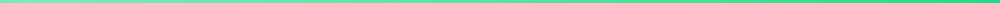
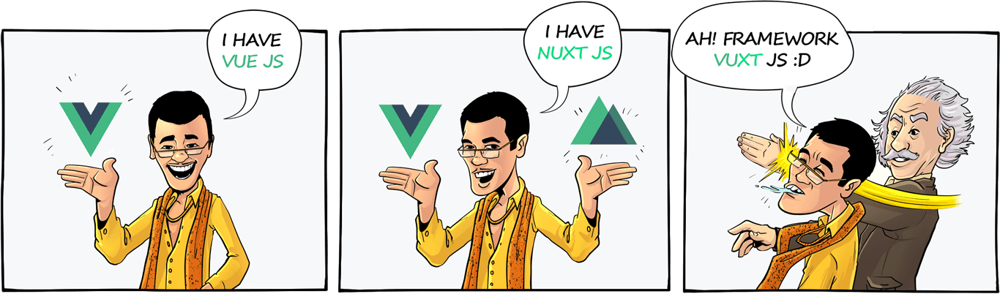

  <h1 align="center">🖐 Hello everyone ! I'm Hieu 😁</h1>
  

      
    &nbsp;I'm Front-End Developer in Vietnam&nbsp;
     
  

  

&nbsp;

  
  
  

  
  

   

  <em><b>The framework JS I am currently working for is</b></em>

&nbsp;

  
  

&nbsp;

### 👨‍💻 About Me :
### 🐾 Future Direction :
### 🛠️ Languages and Tools :

    &nbsp;
    &nbsp;
    &nbsp;
    &nbsp;
    &nbsp;
    &nbsp;
    &nbsp;
    &nbsp;
    &nbsp;
    &nbsp;
    &nbsp;
    &nbsp;
    &nbsp;
    &nbsp;
    &nbsp;
    &nbsp;
    &nbsp;
    &nbsp;
    &nbsp;
    &nbsp;
    &nbsp;

&nbsp;

  

